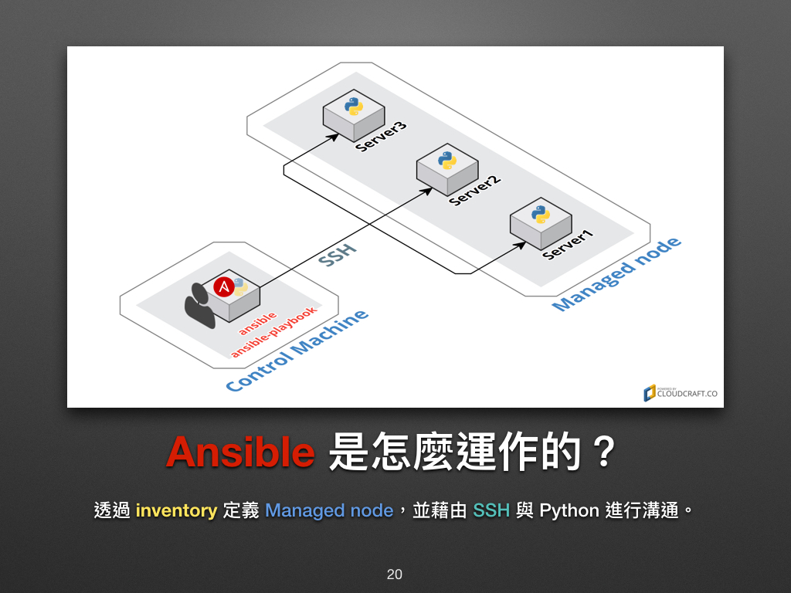
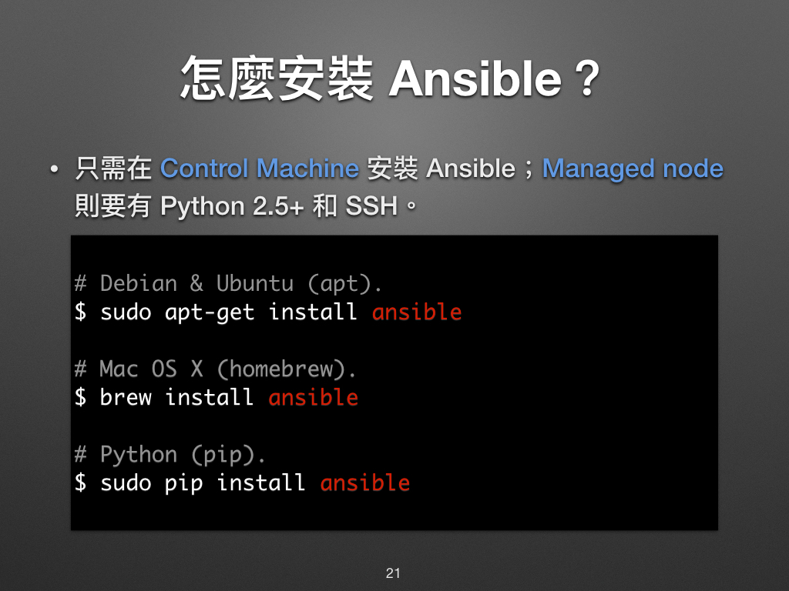
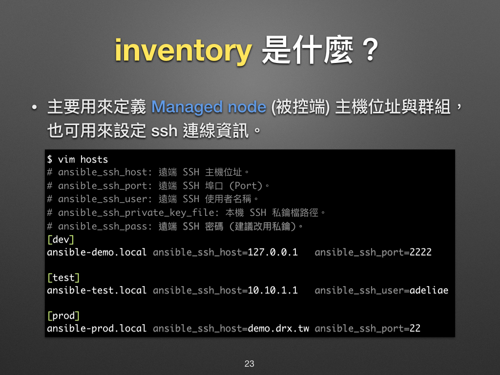

[toc]
 

ref:
- [凍仁 ansible](https://github.com/chusiang/automate-with-ansible)


---


# Ansible - deploy the ansible

---

## deploy the env 


Ansible 的運作
- 透過 **inventory 檔案** 來定義有哪些 **Managed node** (被控端)
- 並藉由 **SSH** 和 **Python** 進行溝通。



換句話說，當 Control Machine (主控端) 可以用 SSH 連上 Managed node，且被連上的機器裡有預載 Python 時，Ansible 就可以運作了！

- `Control Machine` 指的是我們主要會在上面操作 Ansible 的機器，凍仁喜歡用**主控端**來形容它。它可以是我們平時用的電腦、手機 [^1] 或機房裡的某一台機器，也可以把它想成是一般 Lab 練習裡的 `Workstation`。

- `Managed node` 則是被 Ansible 操縱的機器，凍仁喜歡用**被控端**來形容它。在很多的 Lab 練習裡會用 `Server` 來稱呼它。


### 怎麼安裝 Ansible？

在一般的情況下，**我們只需在 Control Machine 裡安裝 Ansible 即可**，因為 GNU/Linux 和 macOS 的 Managed node 都早已預載了 Python 2.5 以上的版本，且開通了 SSH 連線的條件。

若想拿 Ansible 來管 Windows 了話，則需進行較多的設置。大家可參考凍仁先前分享的 [Ansible - Roles & Windows][automate-with-ansible-roles-windows] 簡報和[官方文件][windows_support]。

[automate-with-ansible-roles-windows]: http://note.drx.tw/2016/07/automate-with-ansible-roles-windows.html
[windows_support]: https://docs.ansible.com/ansible/latest/user_guide/windows.html




#### 在 Control Machine 上安裝 Ansible

礙於文章篇幅，這裡只會提到凍仁較常用的環境，其餘的部份還請參考[官方文件][ansible_official_installation]和 Ansible 台灣使用者社群所維護的 [Ansible 安裝教學][ansible_tw_installation]。

[ansible_official_installation]: https://docs.ansible.com/ansible/latest/installation_guide/intro_installation.html
[ansible_tw_installation]: http://ansible.tw/#!docs/installation.md

> 目前最新釋出的 Ansible 版本為 v2.2.0.0。

##### Ubuntu (Apt)

1. 安裝 `add-apt-repository` 必要套件。

  ```
  $ sudo apt-get install -y python-software-properties software-properties-common
  ```

2. 使用 Ansible 官方的 PPA 套件來源。

  ```
  $ sudo add-apt-repository -y ppa:ansible/ansible; sudo apt-get update
  ```

3. 安裝 Ansible。

  ```
  $ sudo apt-get install -y ansible
  ```

##### CentOS (Yum)

1. 新增 `epel-release` 第三方套件來源。

  ```
  $ sudo yum install -y epel-release
  ```

2. 安裝 Ansible。

  ```
  $ sudo yum install -y ansible
  ```

##### macOS (Homebrew)

1. 請先安裝 [homebrew](http://brew.sh/index_zh-tw.html)，已安裝者請略過。

  ```
  $ /usr/bin/ruby -e "$(curl -fsSL https://raw.githubusercontent.com/Homebrew/install/master/install)"
  ```

2. 安裝 Ansible。

  ```
  $ brew install ansible
  ```

##### Python (Pip)

Ansible 近來的釋出速度很快，若想追求較新的版本可改用 **Pip** 的方式進行安裝，較不建議初學者使用。

1. 需請先安裝 [pip][pip]，已安裝者請略過。

  ```
  # Debian, Ubuntu
  $ sudo apt-get install -y python-pip

  # CentOS
  $ sudo yum install -y python-pip

  # macOS
  $ sudo easy_install pip
  ```

  [pip]: https://pypi.python.org/pypi/pip

2. 升級 pip。

  ```
  $ sudo pip install -U pip
  ```

3. 安裝 Ansible。

  ```
  $ sudo pip install ansible
  ```


#### 在 Managed Node 安裝 OpenSSH server 和 Python

正常在 Managed Node 我們都會安裝 OpenSSH server 和開通連線權限以便於遠端管理，OpenSSH 這邊凍仁就不多加贅述了。

Python 的部份呢？雖說現代的 GNU/Linux 大多都早已內建了，可 Ansible 預設使用的 Python 是 2.x 的版本，這在 Ubuntu 16.04 預載 Python 3.4 的環境上需做些調整，詳情請參閱 [Python 3 Support | Ansible Documentation][ansible_docs_python3_support] 一文。[^2]

[ansible_docs_python3_support]: https://docs.ansible.com/ansible/latest/reference_appendices/python_3_support.html

- Ubuntu.

  ```
  $ sudo apt-get install -y openssh-server python2.7
  ```

- CentOS.

  ```
  $ sudo yum install -y openssh-server python
  ```

- macOS: 在 macOS 10.11 裡，我們只需使用內建的 OpenSSH server 和 Python 即可，詳情請參考 Apple 官方的 [OS X El Capitan: 允許遠端電腦取用您的 Mac](https://support.apple.com/kb/PH21839?viewlocale=zh_TW&locale=zh_TW) 一文進行設置。


### 怎麼設定 Ansible？

我們可以藉由 `ansible.cfg` 來設定預設的 **inventory 檔案的路徑**、**遠端使用者名稱**和 **SSH 金鑰路徑**等相關設定。


▲ `hostfile` 參數即將在 Ansible 2.8.0 被移除，若您是使 Ansible 2.4.0 以上的版本，請改用 `inventory`，詳情請參考[官方文件](https://docs.ansible.com/ansible/latest/installation_guide/intro_configuration.html#hostfile)。

1. 安裝好 Ansible 後，我們可以在 `/etc/ansible/` 的目錄底下找到 Ansible 的設定檔。
2. 通常我們較偏愛把 `ansible.cfg` 和 `hosts` 這兩個檔案與其它的 `Playbooks` 放在同個專案目錄底下，然後透過版本控制系統 (例如 Git) 把它們一起儲存起來，以實現 Ansible 的 [*Infrastructure as Code*][infra_as_code]！

[infra_as_code]: https://en.wikipedia.org/wiki/Infrastructure_as_Code


#### inventory 是什麼？

`inventory` 就單字本身有**詳細目錄**、**清單**和**列表**的意思。在這裡我們可以把它當成是一份主機列表，我們可透過它對定義每個 Managed Node 的代號、IP 位址、連線相關資訊和群組。



1. 若有對 Control Machine 本機操作的需求，建議於 `/etc/ansible/hosts` 補上 local 的設定。

  ```
  # For root user.
  $ /bin/echo -e "[local]\nlocalhost ansible_connection=local" >> /etc/ansible/hosts

  # For sudo user.
  $ sudo su -c '/bin/echo -e "[local]\nlocalhost ansible_connection=local" >> /etc/ansible/hosts'
  ```


#### Hello World

當已上的設置都完成了，您可以試著在終端機裡用 Ansible 呼叫本機印出 `Hello World`。

```
$ ansible localhost -m command -a 'echo Hello World.'
localhost | SUCCESS | rc=0 >>
Hello World.
```

歡迎來到 Ansible 的世界！:D


### 相關連結

- [現代 IT 人一定要知道的 Ansible 自動化組態技巧 | 凍仁的筆記](http://note.drx.tw/2016/05/automate-with-ansible-basic.html)


[^1]: 相信在這個智慧型手機裡盛行的時代，要在手機裡裝個 Python 和 OpenSSH 一定不是什麼難事 (笑)。在台灣還有人整合了 Ansible 與聊天機器人 (Chatbot)，這樣出門在外只要有手機和網路就可以遠端工作了！(詳情請參考[從 DevOps 到 ChatOps：War Room、Bots 與 Automation][devops-chatopswar-roombots-automation] 的簡報)

[^2]: Ansible 已在 2.2 時加入了 Python 3 Support 的功能，感謝友人 [@maxsolar][@maxsolar] 的 feedback，這下凍仁可以少寫一篇文章了！

[devops-chatopswar-roombots-automation]: http://www.slideshare.net/warfan/devops-chatopswar-roombots-automation
[@maxsolar]: https://github.com/maxsolar

