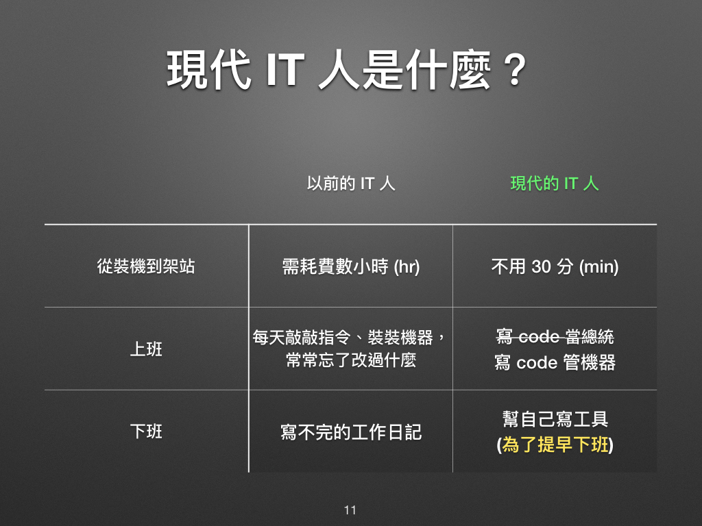
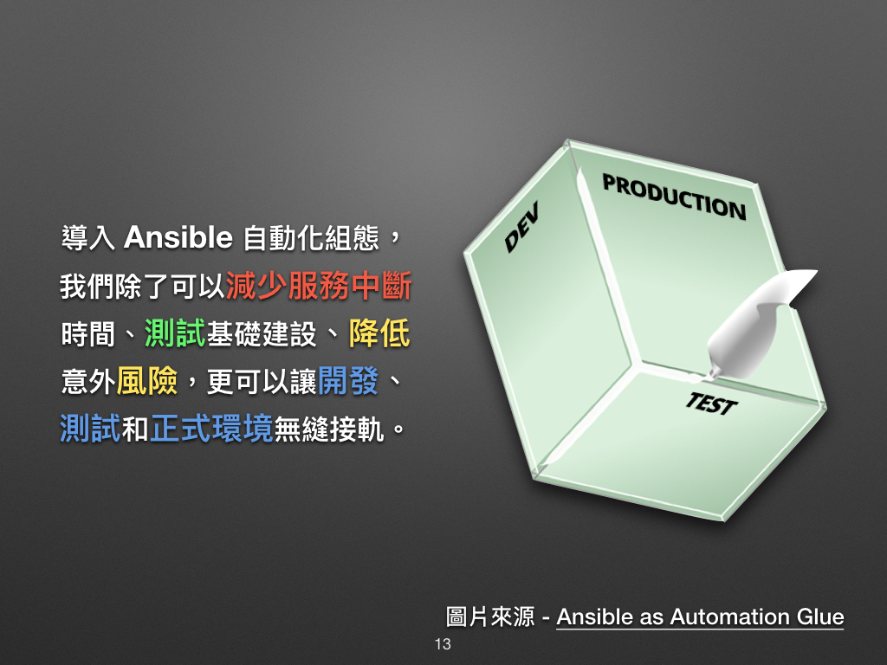
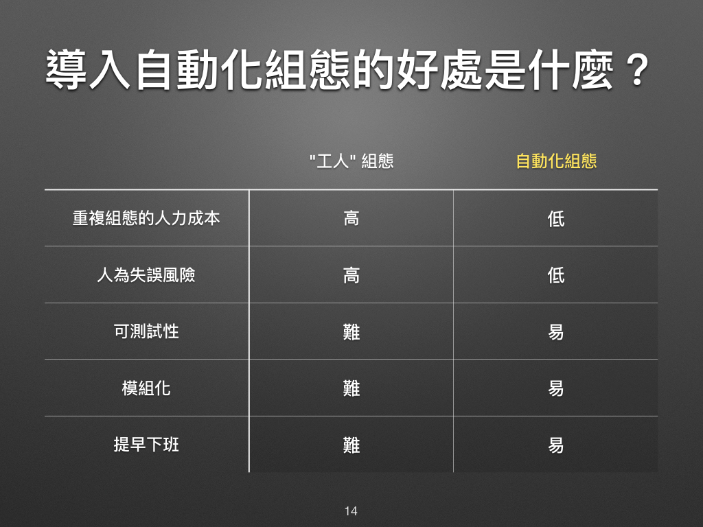

[toc]
 

ref:
- [凍仁 ansible](https://github.com/chusiang/automate-with-ansible)

---

# Ansible 自動化組態技巧

---

## 01. 前言

對於 IT 維運者 
- 得具備十八般武藝，從 **系統規劃**、**部署 (Deployment)**、**開發 (Development)**、**測試 (QA)**、**維運 (Operations)**、**監控 (Monitoring)** 到 **效能優化 (Performance Optimisation)** 等樣樣都要融匯貫通。
- 寫筆記就很難了
- 除了要會管機器、管網路、on-call 之外，還得要會寫些自動化的工具來輔助自己，
  - 把**安裝 (Setup)**、**部署 (Deploy)**、**安全性更新 (Security Upgrade)** 等步驟寫成可以自動化的 Script！ 

「**DevOps**」的名詞概括了不少技能和工具
- 如 `Ansible, Chef, Docker container, Git, Jenkins CI, Vagrant, Zabbix monitoring server` … 等
 

以下是凍仁很喜歡對照表
- 多年前耗費不少的時間在: **安裝作業系統**、**架設** 公司業務所需的大大小小 **服務**、寫寫工作日記提醒自己改了什麼設定；
- 如今藉由**虛擬化技術**、**雲端運算**和**組態管理工具**等，在相對快速的時間裡完成任務。
- 寫筆記不如寫工具！更何況還是可重複使用的工具！！

好處
- 導入自動化組態工具，**減少重複性的工作**
- 最重要的可以提升**正式環境 (Production)** 的**穩定性**和**可靠性**！

 

當每次的版本釋出 (release)、部署 (deployment) 都會出現不可預測的問題時，將會冒出許多例外工作，這將會大幅度拖累我們的工作進度。

養兵千日用在一時，當我們準備好，就可以在很短的時間內對正式環境進行部署和維護等變更工作，尤其是半夜 12 才要上線的那種 ...。

還記得那一年，開發者 (Developers) 透過 FTP 手動更新程式，發現臭蟲 (bug) 想退版卻無從下手的慘痛經驗！這不只拖累公司整體的業務，還引起了顧客的不滿。

但其實我們只需透過自動化組態工具管理這些變更，再搭配版本控制系統和測試，就能有效避免這類問題發生。

準備好了嗎？Ansible 的大門就在前面了！

### 相關連結

* [「Ansible 自動化組態管理實戰講堂」與「自我實現」 | 凍仁的筆記](http://note.drx.tw/2016/03/ansible-workshop-and-self-realization.html)
* [現代 IT 人一定要知道的 Ansible 自動化組態技巧 | 凍仁的筆記](http://note.drx.tw/2016/05/automate-with-ansible-basic.html)

[^1]: 組態管理工具 (Configuration management Tool) 一般我們會簡稱為 CM Tool，而在業界我們還會用 [Infrastructure as Code (IaC)](https://en.wikipedia.org/wiki/Infrastructure_as_Code) 的字眼來形容這些工具。

[^2]: 隔壁棚的 Miles 有專門撰寫篇[什麼是 DevOps？](http://ithelp.ithome.com.tw/articles/10184557)的文章，不妨也參考一下喔。
