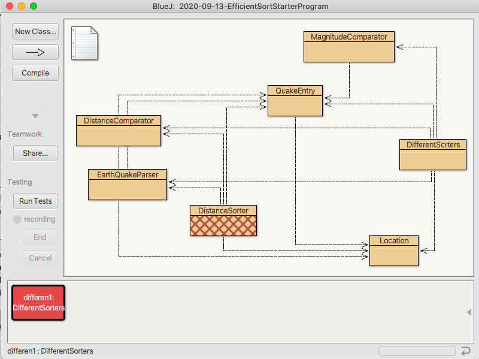

[toc]

---

# Programming Exercise 2 `Sorting at Scale`

Resource Link: http://www.dukelearntoprogram.com/course4/index.php

ProjectCode: https://github.com/ocholuo/language/tree/master/0.project/javademo

---

## Assignment 1: compareTo Method

- Modify the compareTo method in the QuakeEntry class. (You may want to comment out the current code first). The compareTo method should now sort quake by magnitude first, from smallest magnitude to largest magnitude, and then break ties (use == operator to determine whether magnitudes are equal) by depth, from smallest (most negative)
depth to largest depth.

- Test the compareTo method by running the sortWithCompareTo method in the DifferentSorters class with any data file. The sort used is Collections.sort. You should be able to see that the earthquakes are sorted by magnitude, and those with the same magnitude are sorted by depth.


---

## Assignment 2: Title Comparator

1. Write the TitleAndDepthComparator class that implements a Comparator of type QuakeEntry.
   - In this class you should write the compare metho
   - has two parameters, a QuakeEntry named q1 and a QuakeEntry named q2.
   - This method should compare the title of q1 and q2.
     - If q1 title comes before q2 title in alphabetical order, then this method should return a negative integer.
     - If q1 title comes after q2 title, then this method should return a positive integer.
     - If q1 title is the same as q2 title, then this method should compare the depth of the two earthquakes.
         - If q1 depth is less than q2 depth, then this method should return a negative number.
         - If q1 depth is greater than q2 depth, then this method should return a positive integer.
         - Otherwise, this method should return 0.

2. Write the void method sortByTitleAndDepth in the DifferentSorters class.
   - This method should create an EarthQuakeParser, read data from a file on earthquakes and create an ArrayList of QuakeEntry.
   - Then this method should call `Collections.sort on` this ArrayList and use the TitleAndDepthComparator to sort the earthquakes.
   - You should be able to see that the earthquakes are sorted by title first, and those with the same title are sorted by depth.
   - Modify this method to print out the QuakeEntry in the ArrayList in position 10 (which is actually the 11th element in the ArrayList) after sorting and printing out all the elements.

---

## Assignment 3: Last Word in Title Comparator

1. Write the TitleLastAndMagnitudeComparator class that implements a Comparator of type QuakeEntry.
   - In this class you should write the compare method
   - has two parameters, a QuakeEntry named q1 and a QuakeEntry named q2.
   - This method should compare the last word in the title of q1 and q2.
   - If q1 last word comes before q2 last word in alphabetical order, then this method should return a negative integer.
   - If q1 last word comes after q2 last word, then this method should return a positive integer.
   - If q1 last word is the same as q2 last word, then this method should compare the magnitude of the two earthquakes.
       - If q1 magnitude is less than q2 magnitude, then this method should return a negative number.
       - If q1 magnitude is greater than q2 magnitude, then this method should return a positive integer. Otherwise, this method should return 0.

2. Write the void method sortByLastWordInTitleThenByMagnitude in the DifferentSorters class.
   - This method should create an EarthQuakeParser, read data from a file on earthquakes and create an ArrayList of QuakeEntry.
   - Then this method should call Collections.sort on this ArrayList and use the TitleLastAndMagnitudeComparator to sort the earthquakes.
   - You should be able to see that the earthquakes are sorted by the last word in their title, and those with the same last word are sorted by magnitude.
   - Modify this method to print out the QuakeEntry in the ArrayList in position 10 (which is actually the 11th element in the ArrayList) after sorting and printing out all the elements.

